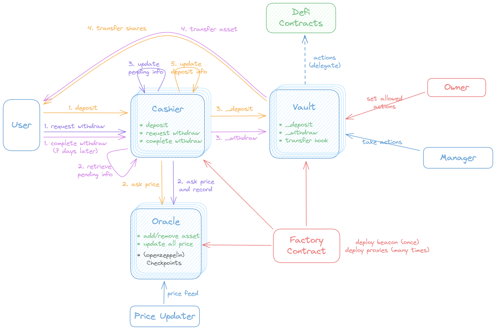

# Pump Liquid Contract

The contract user flow is as follows:



## Test

The test coverage result is as follows:

File                |  % Stmts | % Branch |  % Funcs |  % Lines |Uncovered Lines |
--------------------|----------|----------|----------|----------|----------------|
 contracts/         |      100 |    67.74 |      100 |      100 |                |
  LiquidCashier.sol |      100 |    69.39 |      100 |      100 |                |
  LiquidFactory.sol |      100 |       50 |      100 |      100 |                |
  LiquidOracle.sol  |      100 |    71.05 |      100 |      100 |                |
  LiquidVault.sol   |      100 |       65 |      100 |      100 |                |
  constants.sol     |      100 |      100 |      100 |      100 |                |
  interface.sol     |      100 |      100 |      100 |      100 |                |
 contracts/lib/     |      100 |      100 |      100 |      100 |                |
  BytesBitwise.sol  |      100 |      100 |      100 |      100 |                |
 contracts/mock/    |      100 |      100 |      100 |      100 |                |
  MockToken.sol     |      100 |      100 |      100 |      100 |                |
  MockWETH.sol      |      100 |      100 |      100 |      100 |                |
  UniswapImport.sol |      100 |      100 |      100 |      100 |                |
All files           |      100 |    68.09 |      100 |      100 |                |

This result can be checked by running the following command:

```bash
npm hardhat coverage
```
